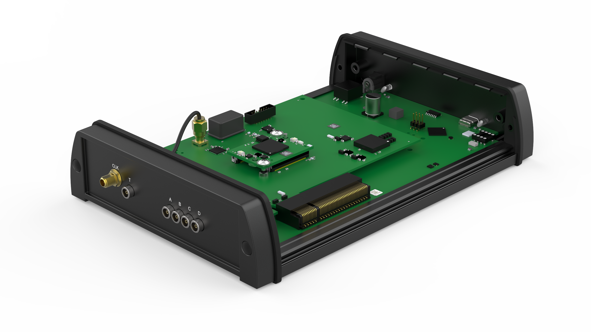

Hardware
========

:numref:`Figure %s<overview_open>` gives an overview of the TBT2PCIe crate with
an HPTDC4-PCIe board installed.

.. _overview_open:

    
    TBT2PCIe crate with removed top cover and an HPTDC4 board.

Installing a TDC board
----------------------

#. Remove the top cover of the TBT2PCIe crate by doing XYZ.
#. Remove the metal rail from your TDC board by removing the two screws holding
   it in place.
#. Connect your TDC board to the PCIe slot of the TBT2PCIe crate.
#. Use the threaded holes where the metal cover of the TDC board was connected
   to secure the TDC board to the TBT2PCIe crate.
#. If present, connect the J25 connector.
#. Close up the TBT2PCIe crate.

..
    :numref:`Figure %s<fig1>` gives an overview of the adapter and
    :numref:`Tab. %s<tab1>` gives an overview of the interface.

    .. _fig1:
    .. figure:: _figures/XHPTDC4-PCIe
        :alt: Front, back, and side view of the Thunderbolt2PCIe adapter.
        
        Dummy picture. For a description of the labels, see :numref:`Tab. %s<tab1>`.

    .. tabularcolumns:: c|c

    .. _tab1:
    .. table:: Interface of the Thunderbolt2PCIe adapter.

        =====  ===========
        Label  Description
        =====  ===========
        \(1)    Input for external power supply
        \(2)    USB-C / Thunderbolt connector
        \(3)    Status LED external power supply
        \(4)    Status LED for power supply over USB-C
        =====  ===========

    Section
    -------

    .. code-block:: c++

        void my_func(param)
        {
            int i = 0;
        }

    Subsection
    ~~~~~~~~~~

    Subsubsection
    ^^^^^^^^^^^^^

    Paragraph
    '''''''''