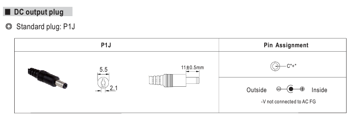

Hardware
========

:numref:`Figure %s<overview_open>` gives an overview of the TBT2PCIe crate with
an HPTDC4-PCIe board installed. The front and back panel are shown in 
:numref:`Figure %s<overview_frontback>`.

.. _overview_open:
.. figure:: _figures/XHPTDC4-PCIe_032_Front_view_no_top_cover.png
    
    TBT2PCIe crate with removed top cover and an HPTDC4 board.

.. _overview_frontback:
.. figure:: _figures/frontback.*

    Front and back panel of the TBT2PCIe crate. The front panel depends on 
    the TDC card that is installed. :raw-latex:`\textcolor{red}{Is that so?}`
    The interface at the fron panel is the same as the interface of your TDC
    board.

Installing a TDC board
----------------------

#. A list on how to install it

Power requirements
------------------

It is possible to supply the TBT2PCIe crate with sufficient power via the
USB-C/Thunderbolt connector. If that is the case, the LED next to the USB-C
port (see :numref:`Fig. %s<overview_frontback>`) lights up **green**
(input voltage :math:`>` |nbws| 8 |nbws| V) and no additional power supply
needs to be connected. If the LED lights up **red**, an external power supply
is necessary.

.. note::
    No external power supply is provided with the TBT2PCIe crate.

In case an external power supply is necessary, we recommend the
MeanWell GST40A12-P1J (12 |nbws| V |nbws| DC, 3.34 |nbws| A) power supply.
However, any power supply providing
**12** |hyphen| **17.5** |nbws| **V** |nbws| **DC @ 3** |nbws| **A**
with a standard P1J plug (see :numref:`Fig. %s<p1j>`) is sufficient.

If the power supply connected to the EXT PWR socket is sufficient, the LED
next to it will light up **green** (input voltage
:math:`>` |nbws| 11.3 |nbws| V).

.. note::
    While an external power supply is connected, the TBT2PCIe crate does not
    draw power via the USB-C port.

.. _p1j:

    Standard P1J plug fitting the TBT2PCIe crate power socket.