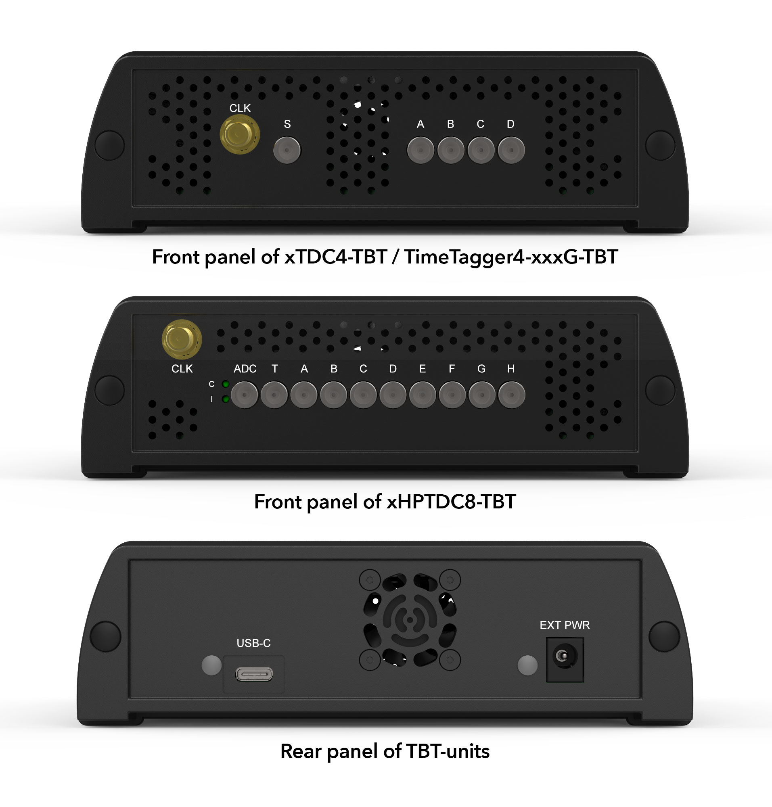

Hardware
========

.. _overview_frontback:

    Front and back panel of the TBT variant of our TDC cards.

Power requirements
------------------

The power requirements and the need for an external power supply depend on the 
particular card.

TimeTagger4 (all variants)
    No external power supply is necessary. Power is supplied by the USB4 port.

xTDC4
    An external power supply providing **14–15 V DC @ 45 W** is necessary.

xHPTDC8
    An external power supply providing **14–15 V DC @ 60 W** is necessary.

If a power supply is necessary, we recommend the
`MeanWell GST60A15-P1J <https://www.meanwell.com/Upload/PDF/GST60A/GST60A-SPEC.PDF>`_
(15 V DC, 60 W, 4 A) power supply.
However, any power supply providing sufficient power at 
14–15 V DC with a plug as depicted in :numref:`Fig. %s<p1j>` is sufficient.

.. _p1j:
.. figure:: _figures/powerplug_overview.*

    Requirements for plugs fitting the EXT PWR socket of the device.

.. note::

    No external power supply is provided with the TBT variants of our TDC
    cards.

Power-up sequence
*****************

*The below only applies to the xTDC4-TBT and xHPTDC8-TBT card.*

For a proper boot sequence, it is important to:

- **First** connect the power supply.
- Then, the **EXT PWR LED** will light up **green** (unless the supplied power 
  is not sufficient).
- **Only now** establish the the USB4 connection.

.. attention::

    The xTDC4-TBT and xHPTDC8-TBT cards will only work with the correct
    power-up sequence.

In case you did not follow the above procedure and the TBT card is not
recognized by your device, remove the USB4 and power supply connections, then
follow the correct procedure. If afterwards the TBT card is still not 
recognized, a reboot of your system is necessary.

LEDs
----

The back panel features two LEDs:

USB-C
    This LED indicates a sufficient power supply by the USB-C port if green.
    It is only relevant for the TimeTagger4.

EXT PWR
    This LED indicates sufficient (green) or insufficient (red) power supply.
    If it is red, the connected power supply does not provide enough power.
    It is only relevant for the xTDC4 and xHPTDC8.

Inputs and connectors
---------------------

For the front-panel connectors, refer to the main User Guide of the
particular TDC card in your device.

TimeTagger4:
    - `<https://download.cronologic.de/TimeTagger/TimeTagger4_User_Guide.pdf>`_
  
xTDC4:
    - `<https://download.cronologic.de/xTDC4-PCIe/xTDC4_User_Guide.pdf>`_

xHPTDC8:
    - `<https://download.cronologic.de/xHPTDC8-PCIe/xHPTDC8_User_guide.pdf>`_

Optional Addons
---------------
It is possible to buy **wall brackets** and **tower feet** for the crate (
see :numref:`Fig. %s<fig addons>`). These 
are not sold by cronologic, but you can purchase them from
`BOPLA enclosures <https://www.bopla.de/en/>`__.

Wall brackets
    | `AS 0030-0200 WL-7024 <https://www.bopla.de/en/enclosure-technology/alustyle/accessories-6/wall-brackets-3/as-0030-0200-wl-7024>`_
    | Order no.: 94722200
    | Profile length 200 mm

Tower feet
    | `AS 0030-0200 T-7024 <https://www.bopla.de/gehaeusetechnik/alustyle/zubehoer-6/towerfuesse/as-0030-0200-t-7024>`_
    | Order no.: 94762200
    | Profile length 200 mm

.. _fig addons:

    Optional addons for the TBT variant of our TDC cards. Left: universal wall 
    brackets; right: tower feet (sold seperately by
    `BOPLA enclosures <https://www.bopla.de/en/>`__).
